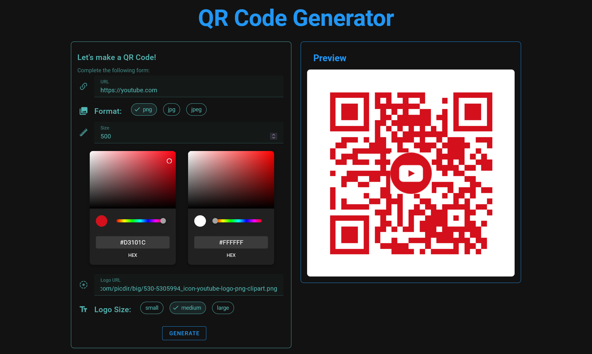
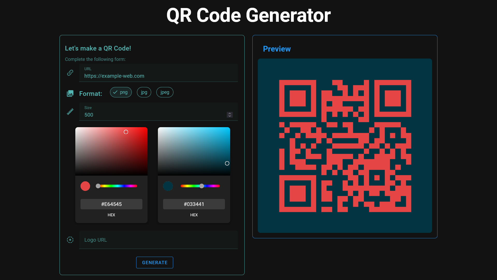

# QR Code Generator Frontend


[](https://www.npmjs.com/package/axios/v/1.7.2)


This is a simple Vue.js application for generating QR codes with customizable options.

## ❗️ Features

- Generate QR codes with the following customizable options:
- - URL to encode
- - Image format (PNG, JPEG, WebP)
- - Size
- - Error correction level
- - Dark and light colors
  - Logo overlay with customizable size ratio
- Preview of the QR code generated based on user inputs.

## 💿 Install

1. Clone the repository:
```sh
git clone https://github.com/your-username/qr-code-generator-frontend.git
cd qr-code-generator-frontend
```

2. Install dependencies:
```sh
npm install
```

3. Start the development server:
```sh
npm run dev
```

3. OR Build and preview:
```sh
npm run build
...
npm run preview
```

The app will be served at localhost:3000 by default.

## 💡 Usage

1. Open your browser and navigate to the application URL.
2. Enter the URL you want to encode.
3. Customize the QR code appearance:
  - Select image format (PNG, JPEG, WebP).
  - Choose the size of the QR code.
  - Pick colors for the pattern and background.
  - Optionally, provide a logo URL and adjust the size ratio.
  - The preview will update dynamically based on your selections.
4. Click "Generate" to see the final QR code image.

## 🖼️ Examples





Technologies Used

- Vue.js
- Vite
- Vuetify
- Axios


## 📑 License
[MIT](http://opensource.org/licenses/MIT)

This project is licensed under the MIT License.
